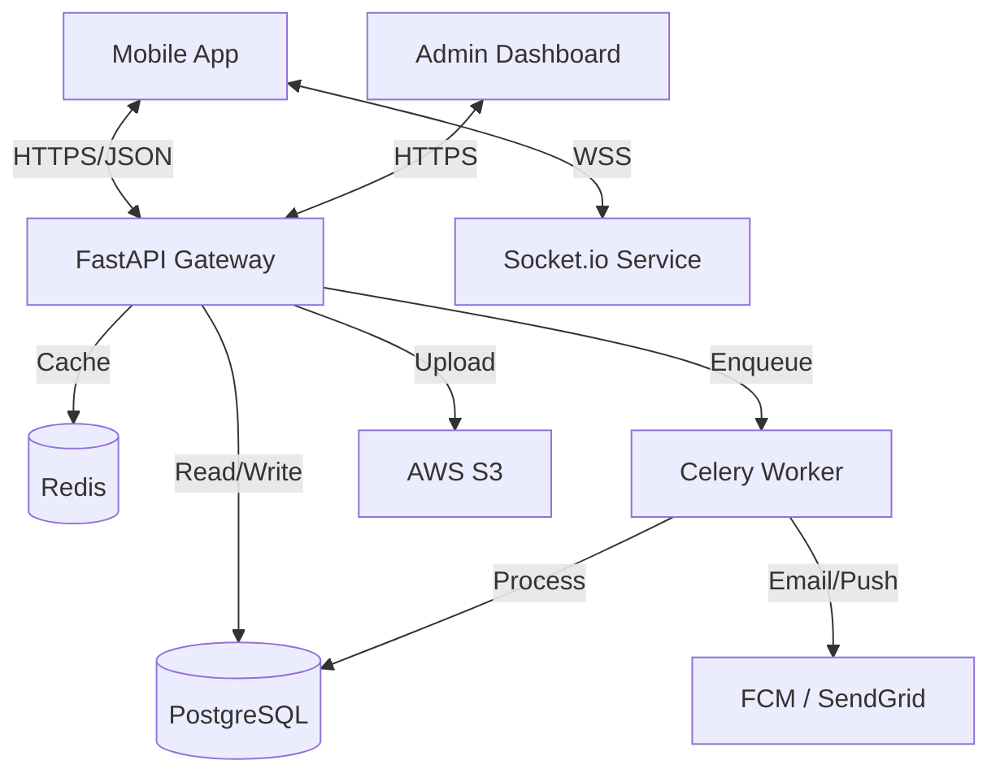

# Backend Implementation Plan: Contri Mobile (Python/FastAPI)

This document outlines the detailed implementation plan for the backend of the Contri Mobile application, using a modern Python stack.

## 1. Technology Stack

-   **Runtime**: Python 3.11+
-   **Web Framework**: **FastAPI** (High performance, easy documentation)
-   **Database**: PostgreSQL 16
-   **ORM**: **SQLModel** (Combines SQLAlchemy & Pydantic for type safety). *DTOs are managed via inheritance (e.g., `UserBase`, `UserCreate`, `UserRead`) to DRY (Don't Repeat Yourself).*
-   **Migrations**: Alembic
-   **Authentication**: OAuth2 with JWT (Access + Refresh Tokens)
-   **Social Auth**: Google & Apple Sign-In (using `httpx-oauth`)
-   **Async Tasks**: **Celery** + Redis (for background jobs, scheduled payouts)
-   **Admin Panel**: **SQLAdmin** (Auto-generated admin UI for FastAPI/SQLAlchemy)
-   **Real-time**: Socket.io (via `python-socketio` ASGI)
-   **Validation**: Pydantic v2
-   **Testing**: Pytest + Factory Boy
-   **Monitoring**: Prometheus + Grafana / Sentry
-   **Package Manager**: **uv** (Extremely fast, Rust-based pip alternative)

## 2. System Architecture



## 3. Database Schema (SQLModel)

### A. Core User & Auth
```python
class User(SQLModel, table=True):
    id: uuid.UUID = Field(default_factory=uuid.uuid4, primary_key=True)
    email: str = Field(unique=True, index=True)
    hashed_password: str
    first_name: str
    last_name: str
    phone_number: str | None = None
    avatar_url: str | None = None
    role: str = Field(default="user") # user, admin
    is_verified: bool = Field(default=False)
    referral_code: str = Field(unique=True) # For invitations
    social_provider: str | None = None # google, apple
    social_id: str | None = None
    created_at: datetime = Field(default_factory=datetime.utcnow)
```

### B. Financials
```python
class Wallet(SQLModel, table=True):
    id: uuid.UUID = Field(default_factory=uuid.uuid4, primary_key=True)
    user_id: uuid.UUID = Field(foreign_key="user.id")
    balance: Decimal = Field(default=0.00, max_digits=20, decimal_places=2)
    currency: str = Field(default="NGN")

class BankAccount(SQLModel, table=True):
    id: uuid.UUID = Field(default_factory=uuid.uuid4, primary_key=True)
    user_id: uuid.UUID = Field(foreign_key="user.id")
    bank_name: str
    account_number: str
    account_name: str
    bank_code: str
    is_primary: bool = Field(default=False)
    status: str = Field(default="pending") # pending, verified

class Card(SQLModel, table=True):
    id: uuid.UUID = Field(default_factory=uuid.uuid4, primary_key=True)
    user_id: uuid.UUID = Field(foreign_key="user.id")
    last4: str
    brand: str # visa, mastercard
    expiry_month: int
    expiry_year: int
    auth_token: str # Token from payment provider (Paystack/Stripe)
    signature: str # To prevent duplicate cards
```

### C. Circles (Ajo)
```python
class Circle(SQLModel, table=True):
    id: uuid.UUID = Field(default_factory=uuid.uuid4, primary_key=True)
    name: str
    amount: Decimal
    frequency: str # weekly, monthly
    cycle_start_date: datetime
    status: str = Field(default="active")
    invite_code: str = Field(unique=True)

class CircleMember(SQLModel, table=True):
    user_id: uuid.UUID = Field(foreign_key="user.id", primary_key=True)
    circle_id: uuid.UUID = Field(foreign_key="circle.id", primary_key=True)
    payout_order: int # 1, 2, 3...
    role: str = Field(default="member") # host, member

class Contribution(SQLModel, table=True):
    id: uuid.UUID = Field(default_factory=uuid.uuid4, primary_key=True)
    circle_id: uuid.UUID
    user_id: uuid.UUID
    cycle_number: int
    amount: Decimal
    status: str # paid, pending, late
    paid_at: datetime | None
```

### D. System & Notifications
```python
class Notification(SQLModel, table=True):
    id: uuid.UUID = Field(default_factory=uuid.uuid4, primary_key=True)
    user_id: uuid.UUID
    title: str
    body: str
    type: str # action_required, info, success
    is_read: bool = Field(default=False)
    action_url: str | None # Deep link
    priority: str = Field(default="normal") # high, normal
```

## 4. API Endpoints Specification

### Authentication & Social
-   `POST /auth/signup`: Email/Password registration.
-   `POST /auth/login`: JWT login.
-   `POST /auth/social/google`: Exchange ID token for JWT.
-   `POST /auth/social/apple`: Exchange ID token for JWT.
-   `POST /auth/refresh`: Rotate tokens.
-   `POST /auth/pin`: Set/Change Transaction PIN (Protected, requires password/old pin).
-   `POST /auth/pin/verify`: Verify PIN before sensitive actions (returns a temporary `pin_token`).

### Device & Notifications
-   `POST /devices`: Register FCM token (on login/startup).
-   `DELETE /devices/{token}`: Unregister token (on logout).
-   `GET /notifications`: List user notifications.
-   `POST /notifications/read`: Mark as read.

### User & Profile
-   `GET /users/me`: Profile details + specific "Action Required" items computed dynamically.
-   `PATCH /users/me`: Update profile (Avatar, Name).
-   `GET /users/dashboard`: Aggregate "Total Saved", "Next Payout" stats.
    -   *Logic (Total Saved)*: Sum of all `Contribution` records where `user_id = current_user` and `status = 'paid'`. This represents the user's lifetime savings across all circles.

### Wallet & Transfers
-   `GET /wallet`: Balance.
-   `POST /wallet/deposit`: Initialize Paystack/Flutterwave charge.
-   `POST /wallet/withdraw`: Request payout to linked Bank.
-   `POST /wallet/transfer`: Transfer to another user (Wallet-to-Wallet).
    -   *Logic*: Atomic transaction (Debit Sender -> Credit Receiver).
-   `POST /cards/link`: Add new card.
-   `GET /banks`: List linked accounts.
-   `POST /banks`: Link new bank.

### Webhooks (Callbacks)
-   `POST /webhooks/paystack`: Handle payment success/failure events.
    -   *Action*: Update `Transaction` status -> Credit `Wallet`.
-   `POST /webhooks/smileid`: Handle KYC verification events.
    -   *Action*: Update `User.kyc_status`.

### Circles & Invites
-   `POST /circles`: Create + Host.
-   `POST /circles/join`: Join via `invite_code`.
-   `GET /circles/{id}/chat`: History.

### Admin Panel (SQLAdmin)
-   Auto-generated UI at `/admin`.
-   Manage Users (Ban/Verify).
-   Monitor Transactions.
-   View Circle Health.
-   **Audit Logs**:
    -   Track every admin action (WHO banned User X, WHO reversed Transaction Y).
    -   *Model*: `AdminLog(admin_id, action, target_id, ip_address, timestamp)`.

## 5. Production Grade Development Suggestions

1.  **Containerization**: Use **Docker** & **Docker Compose** for the API, Worker, DB, and Redis. ensures consistency across dev/prod.
2.  **CI/CD Pipeline**: GitHub Actions to:
    -   Run `pytest` on PRs.
    -   Lint with `ruff`.
    -   Build and push Docker images to registry on merge.
3.  **Security**:
    -   **Rate Limiting**: Use `slowapi` to prevent brute force.
    -   **CORS**: Strict allowed origins.
    -   **Helmet**: Middleware to set security headers.
4.  **Logging & Monitoring**:
    -   Structured Logging (JSON format).
    -   **Sentry** for error tracking.
    -   **Prometheus** endpoint for metrics (req/sec, latency).
5.  **Environment Config**: Use `pydantic-settings` to strictly validate `.env` files (fail startup if DB_URL is missing).
6.  **Database Strategy**: 
    -   Connection Pooling (PgBouncer or SQLAlchemy internal pool).
    -   Regular automated backups.

## 6. Project Structure

```bash
backend/
├── app/
│   ├── api/
│   │   ├── v1/
│   │   │   ├── endpoints/  # auth.py, wallet.py, circles.py
│   │   │   └── api.py      # Router aggregation
│   │   └── deps.py         # Dependencies (get_current_user, get_db)
│   ├── core/
│   │   ├── config.py       # Pydantic Settings
│   │   └── security.py     # JWT & Password hashing
│   ├── db/
│   │   ├── base.py
│   │   └── session.py
│   ├── models/             # SQLModel classes
│   ├── schemas/            # Pydantic schemas (Request/Response)
│   ├── services/           # Payment, Email, Social logic
│   └── main.py             # App entry point
├── alembic/                # Migrations
├── tests/
├── docker-compose.yml
└── pyproject.toml          # Dependencies
```

## 7. DTO Management (SQLModel Strategy)

We will use **SQLModel's inheritance pattern** to manage DTOs efficiently, reducing duplication between DB models and API schemas.

### Example: User DTOs

```python
# models/user.py

class UserBase(SQLModel):
    email: EmailStr = Field(unique=True, index=True)
    first_name: str
    last_name: str
    is_active: bool = True

class User(UserBase, table=True):
    id: uuid.UUID = Field(default_factory=uuid.uuid4, primary_key=True)
    hashed_password: str

# schemas/user.py

class UserCreate(UserBase):
    password: str

class UserRead(UserBase):
    id: uuid.UUID
    
class UserUpdate(SQLModel):
    first_name: str | None = None
    last_name: str | None = None
    email: EmailStr | None = None
```
